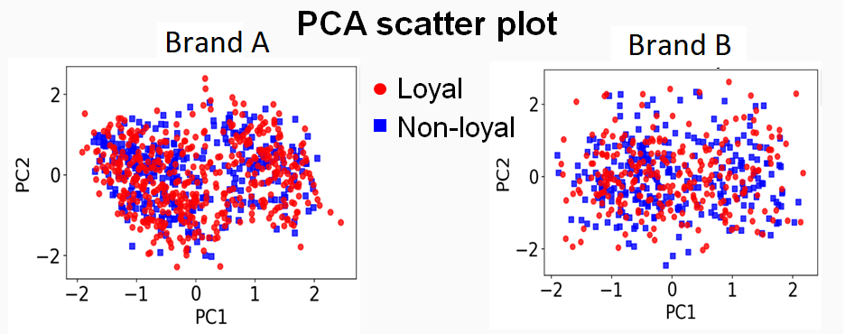
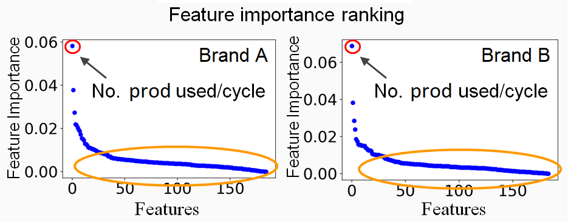
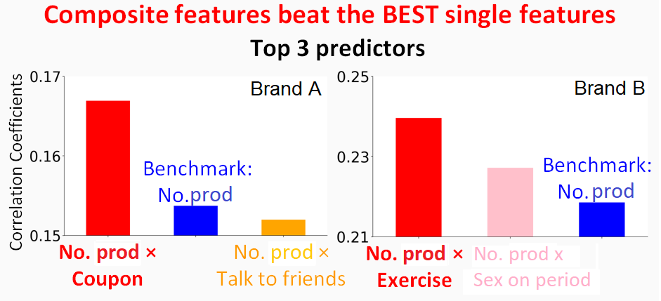

## Presentation

<iframe src="https://docs.google.com/presentation/d/e/2PACX-1vSEylPFSHmQhrUuKemxfo4OOFFSQoXTjqRhQfN2Rwgt5bzoseed95i83BtVYot-PpNbmxiHTGozCVSy/embed?start=false&amp;loop=false&amp;delayms=3000" frameborder="0" width="960" height="569" allowfullscreen="true" mozallowfullscreen="true" webkitallowfullscreen="true"></iframe>

## Introduction

During my time as an Insight Health Data Science Fellow, I consulted with the Sweetie company, a leader in
innovation in femine care, making innovative products for women on their period. Their mission is to reimagine and deliver life-changing period products for women everywhere. Prior to joining Insight, I received my Ph.D. from the Department of Applied Physics at Stanford University, worked as a post-doctoral fellow and research scientist in Lawrence Berkeley National Lab. As I prepared for my transition to industry, I became fascinated by how data analytics can be used to help business get to know their customers well, respond quickly to their customers' needs and make smart marketing decisions. I was therefore excited by the opportunity to work with Sweetie to learn more about capturing marketing insights from user surveys. (Note: for confidentiality reasons, the company name and product brands are aliased.)

## Problem formulation

Sweetie currently own two different brands (A and B) with two very similar products. The company want to understand the key differences between users of each brand to help inform their marketing and distribution strategy. They had several hundred users of each brand (1500 total) fill out an identical survey that was meant to capture customers' demographic, geographic, psychographic, media consumption and purchase behavior information. Sweetie asked for two deliverables: 

1. Across the two segments, what factors are most likely to make someone adopt our product as their primary period product?
2. Is there any significant differences between the two groups? 

## Data overview

There are two sets of survey data, one for each brand. The two surveys asked the same 50 questions about user demographics, product using experience (e.g. how many products do you use per cycle), daily habit (e.g. do you often look for coupons when buying stuff, how many times do you exercise per week?)... etc.
The target question in the survey is "how do you use our product?" In the Brand A dataset, ~60% of the customers answered "I use it as my primary product"; ~37% of the customers answered "the product is great, but I still use others"; ~3% of the customers answered "I'm not sure or I don't use it anymore". 

In the Brand B dataset, ~50% of the customers answered "I use it as my primary product"; ~35% of the customers answered "the product is great, but I still use others"; ~15% of the customers answered "I'm not sure or I don't use it anymore". I labeled those customers whose reponses were "I use it as my primary product" as loyal customers and those whose reponses differed as non-loyal customers. 

Overall, loyal vs non-loyal customers is a 60/40 split in the Brand A dataset, and 50/50 in Brand B dataset.

## Data preprocessing and visualization

For data-preprocessing, I did one-hot-encoding for the following categorical features (examples only, not all the features are listed here) and minmax scaling for all features later.

* 'What is your relationship status?',
* 'What is your ethnicity?',
* 'What is the highest level of education you've received? If currently enrolled, indicate highest degree received.',
* 'On an average day, how busy would you say you are?',
* 'What is your primary type of exercise?',
* 'What made you want to try our product for the first time?',
       
After one-hot-encoding, 50 questions were transformed into 185 features. To visualize the distribution of this high-dimensional data, I made the following PCA scatter plots: 

The PCA scatter plots show that the loyal and non-loyal group are clumped together like a hodgepodge. So, it's definitely a non-trivial classification problem. 

## Objective and approach

The main goal of this project is to find the most useful features for classification rather than the classification model by itself. As a result, I designed my analysis strategy to be use the survey data to build a classification model,  extract feature importance scores from the model and then pick the ones with the highest scores. Here, I choose to use random forest classifier because it's best suited to deal with categorical data and non-linear classification problems. The flow diagram is shown below:

## Feature insight I

After I finished building the modeling and rank the features by their importance scores, I found the single most important feature is the No. of products customers used per cycle, as shown in the following figure:  

Basically, the more they use the more likely they will be loyal and this is true for both brands. This finding could mean that: Customers having high volume of blood during period tend to be loyal. Moreover, this figure is also telling me that, a majority of the 180 features are not useful. They not only waste hard-drive space and computation time but may also introduce extra noise into the data, making the model underperform.

## Feature insight II

For the 2nd round of analysis, I decided to first use the lasso method to prune down the number of features, add all the 2nd-order terms into the feature set to include interaction effects, train the random forest model and then extract feature importance score as done previously. Interestingly, I found some of the interaction terms are better predictors than the product usage # alone. For example, as shown in the following figure, in the Brand A dataset, the No. 1 predictor is the customers use many products and they like to use coupons when buying stuff. In the Brand B dataset, the No. 1 predictor is they use many products and also doing a lot of exercise during the week.

## Conclusions

In this project, I've discovered 3 important traits of loyal customers (as shown in the figure below): 
* Across 2 brands, customers having high volume on period tend to be loyal 
* Brand A users are price sensitive (like to use coupons when making a purchase)
* Brand B users are physically active (like to exercise many times a week)

I translated those discoveries into 3 marketing insights:
* Large absorption volume is the most valuable feature for these products and should be strongly promoted in marketing efforts  
* Hold more sales events for Brand A users to promote customer loyalty
* leak-proof protection even when doing exercise is a great feature to appeal to Brand B users

Final thanks to Mr. Wang, my contact at Sweetie. I enjoyed the opportunity to learn more about marketing research and analytics.
